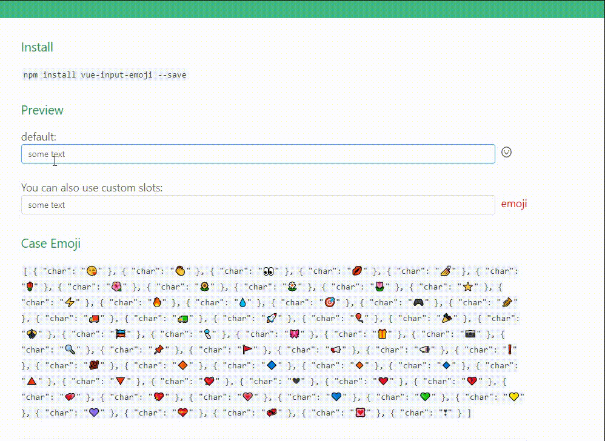

# vue-select-added

> A Vue.js 2.0 input emoji component

<p align="center">
  
</p>

<h4>
tips:It supports all chrome Emoji, but does not support picture Emoji. In lower version operating systems such as Windows 7 and lower version chrome, Emoji displays black and white
</h4>

## Installation

#### NPM / Yarn

```bash
npm install vue-input-emoji --save
```

Then you need to import and register it:

```js
import InputEmoji from "vue-input-emoji";
```

```js
components: {
  InputEmoji;
}
```

## Usage

```js
<InputEmoji v-model="defaultValue" :emojiData="emojiData" />
```
